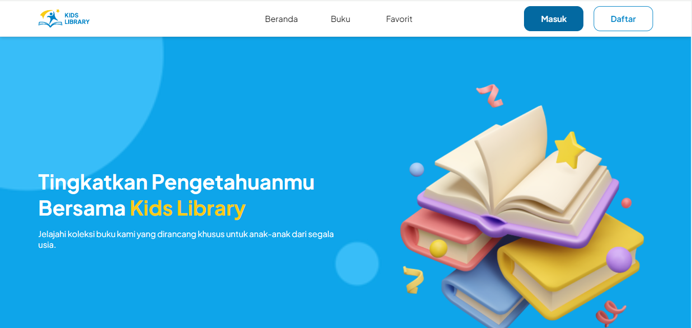

<h1 style="text-align: center; font-weight: 600">KIDS LIBRARY</h1>
<div style="text-align: center">
  
</div>

## Table of Contents
- [About](#about)
- [Tech Stack](#tech-stack)
- [API](#api)
- [Getting Started](#getting-started)
  - [Prasyarat](#prasyarat)
  - [Instalasi](#instalasi)
- [Kontak](#kontak)

<h2 id="about">About</h2>
<p>
  Kids Library adalah inisiatif untuk meningkatkan Sumber Daya Manusia
  Berkualitas melalui bahan bacaan platform digital. Untuk meningkatkan akses
  terhadap literatur anak-anak berkualitas, yang dapat mempengaruhi perkembangan
  intelektual dan kreatifitas.
</p>
<div>
  
  
  
</div>
<h2 id="tech-stack">Tech Stack</h2>
<h3 style="font-weight: 600">Front End</h3>
<ol>
  <li><a href="https://html.com/">HTML</a></li>
  <li><a href="">CSS</a></li>
  <li><a href="https://www.javascript.com/">Javascript</a></li>
</ol>
<h3 style="font-weight: 600">Back End</h3>
<ol>
  <li><a href="https://expressjs.com/">Express</a></li>
  <li><a href="https://www.postgresql.org/">PostgreeSQL</a></li>
</ol>
<h2 id="api">API</h2>
<p><a href="https://api-kidslibrary.hierku.my.id/">Kids Library API</a></p>

<h3 id="prasyarat">Prasyarat</h3>
<p>Node Js (v20.14.0 atau lebih tinggi)</p>
<h3 id="instalasi">Instalasi</h3>

1. Git Clone repository (master) berikut
```
https://github.com/Thahirudin/kl-frontend.git
```
2. Install NPM Packages
```
https://github.com/Thahirudin/kl-frontend.git
```
3. Jalankan Server!
<br>
Development
```
npm run start-dev
```
Production
```
npm run build
npm run serve
```

<h2 id="kontak">Kontak</h2>

1. <a href="https://www.linkedin.com/in/angga-cahyo-krisnanto/">Angga Cahyo krisnanto</a>
2. <a href="https://www.linkedin.com/in/farhan-putra-bunga-mayang-2121892b3/">Farhan Putra Bunga Mayang</a>
3. <a href="https://www.linkedin.com/in/farhan-putra-bunga-mayang-2121892b3/">Thahirudin</a>


